<!DOCTYPE html><html><head>
<meta charset="utf8">
<title>Colorful Critter: Technical Overview</title>
</head>
<body>

# Colorful Critter: Technical Overview

[Colorful Critter](http://fluffy.itch.io/colorful-critter) is a game I made over the course of one week as part of a game jam.

## Motivation

As a kid I enjoyed making weird little experimental games all the time, but aside from a year at Ubisoft I'd not really been doing any game development for quite some time. So when I decided to go indie in January I realized I needed to start with something simple. Fortunately, [eevee](http://eev.ee) was running a [game jam](http://itch.io/jam/strawberry-jam) with a theme I appreciated at just the right time for me to join in.

I had quite a few ideas for a theme-fitting game, but I had just had [GRS](https://en.wikipedia.org/wiki/Sex_reassignment_surgery) at the end of January and didn't have a lot of energy or attention to work on things, so I knew I had to keep it simple. Part of my surgery recovery had me thinking of my body as something of a tamagotchi, needing the right sorts of stimulation at the right time to keep myself from going crazy; one of my working ideas was called "Tamacrotchi" and was based specifically on what I was doing for my recovery.

But, that wasn't really a *horny* game, it was just something about genitals. My One Big Thing is enjoying colors and patterns, especially kitschy things as applied to skin (plaid, polka dots, paisley, that sort of thing), and I decided what would really work for me was a tamagotchi-type thing where the main interaction was by coloring a "critter," which is the name I use for the generic I-don't-know-what-this-is creature that I portray myself as in [my comics](http://beesbuzz.biz/d/cat-journal.php) and Internet presence and so on.

Note that this isn't described in the order that I developed things; it's important to understand that like many game jams, I didn't have a clear idea of how I was going to do things up front and I improvised and experimented as I went.

Also, I invite you to crack open the LÖVE bundle file to look at the source code and assets! Please be mindful of my copyright, of course, but I'd love for people to be able to learn from this experiment. The LÖVE bundle can be decompressed with any tool that can decompress .zip files.

## Gameplay ideal

My specific goal for the gameplay was that people would just start coloring the critter and then discover that it has responsive behaviors based on how it's being interacted with. I didn't want the underlying model to be too obvious, and I wanted it to be able to be temperamental but never to get stuck permanently in a state where you couldn't make it do something else.

I also wanted there to be something that felt like a "success" condition, but nothing that felt like a termination to the experience. I also wanted it to be somewhat like the classic Tamagotchi, such that the critter had a mood and the feeling that one should treat it in certain ways during those different moods.

In playtesting, I found that if I left the debug information visible, people would focus too much on that and just try to hit as many internal states as possible or try to maximize a particular state variable, without actually paying attention to the critter. This was anathema to the experience I wanted.

Most of all I just wanted people to have fun trying to color the critter in whatever way they wanted, and then perceive that the critter has its own biases for how it should be colored. Having people then attempt to tease the critter in different ways would be a bonus emergent interaction.

## Critter State

The critter itself is made of three parts, code-wise: there's a set of "gauges" (not the best term, but it was the internal terminology for a similar concept on [Sprung](https://en.wikipedia.org/wiki/Sprung_(video_game)) and it's mentally stuck for me), a behavior graph (state machine) that is driven by those, and a pose (selected by the behavior graph). The gauges are as follows:

* Anxiety: increases as the mouse moves while the critter isn't being touched
* Itchy: increases while the critter isn't being touched
* Estrus: increases as the mouse moves while the critter is being touched

The critter being touched is defined as the mouse button being held down while the mouse is over a pixel that corresponds to skin. The various gauges also have different damping factors which were basically just tinkered with as I balanced the gameplay.

Every state has a function that maps the current gauge state into what state to transition into; for example, here's the state machine entry for the default state:

    default = {
        pose = "default",
        nextState = (function(c)
            if c.estrus > 0.8 then
                return "aroused"
            elseif c.anxiety < 5 and c.itchy < 5 then
                return "relaxed"
            elseif c.anxiety > 70 then
                return "anxious"
            elseif c.itchy > 8 then
                return "itchy"
            end
        end)
    },

States can also have a bit more advanced behavior in them; for example, this is the "resetting" state:

    resetting = {
        onEnterState = (function(c)
            c.resetFrames = 0
            c.resetCount = 1
            c.skin.front:setFilter("nearest", "nearest")
            c.skin.back:setFilter("nearest", "nearest")
        end),
        nextState = (function(c)
            c.resetFrames = c.resetFrames + 1
            if c.resetFrames >= c.resetCount*5 and c.resetCount <= 5 then
                c.setPattern()
                c.resetFrames = 0
                c.resetCount = c.resetCount + 1
                sound.reset:rewind()
                sound.reset:play()
            end
            if c.estrus < 0.1 then
                return "relaxed"
            end
        end)
    },

The above behavior is responsible for the critter's skin pattern being regenerated (with the click sound played each time) as it recovers from a certain event.

The critter's "estrus" value also drives a "hueshift" value; the higher the estrus, the faster the hue shifts.

## Visual Display

I absolutely adore the pixelated, limited-color look of computers from my childhood; I grew up with a Commodore 64, and really came into game programming on VGA mode 0x13 (or, mode 13h as I called it back then, due to primarily doing game dev in Turbo Pascal). I knew right away that I'd want to do something evocative of that. To that end, I opted to make the color picker specifically be a simple HSV-ish picker with a limited selection and a pattern dither.

There's also a neat trick that used to be used in games and demos a lot but has been more or less forgotten since then: static UV maps. This trick was used a lot to speed up fake "3D" rendering, for example the [inside of a tunnel](https://youtu.be/4ncoe_hHrfs?t=2m40s) or complex [reflections](https://youtu.be/rFv7mHTf0nA?t=6m58s) and [projections](https://youtu.be/rFv7mHTf0nA?t=3m56s) in 3D space. The idea is pretty simple - rather than store the texture coordinates in a bunch of vertex attributes to render, you just store them in a texture; in my case I used the red channel for U and the green channel for V. (Originally I used the blue channel to encode some other stuff but it turned out to not be useful, and instead I liked having a visible grid there for when I prepared the UV maps.)

How I actually prepared the UV map was straightforward, as well; I created a layered gradient in Photoshop, which looks like this:

and flattened that to a single layer, and also put some annotations in a layer above so I could maintain some level of consistency between poses; the annotated version looks like this:

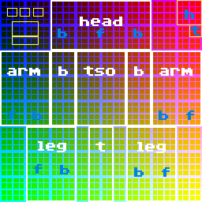

So, in order to build the UV map, I'd just grab a rectangle of texture coordinates from the flattened layer and then use various distort tools in Photoshop (mostly [Warp](https://helpx.adobe.com/photoshop/using/transforming-objects.html) and [Puppet Warp](https://helpx.adobe.com/photoshop/using/warp-images-shapes-paths.html)) until I got something that looked more or less like this:

Because of the way that UV maps work, however, I actually separated them out into separate non-overlapping layers, like this:

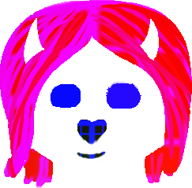  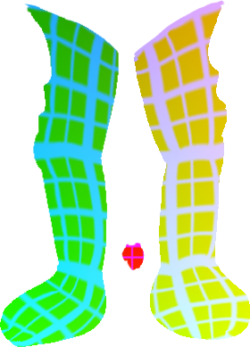 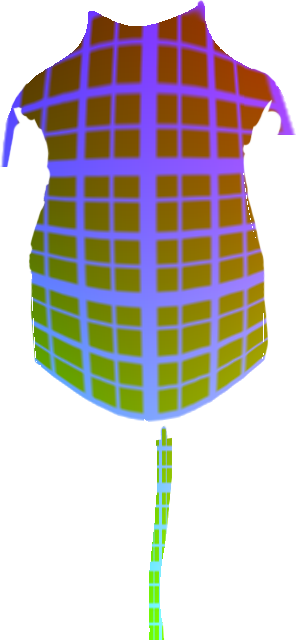

and then wrote an ImageMagick script to resize them to the target resolution and composite them without blending, to avoid any weird things where things overlap.

The actual render process is as follows:

* Use the UV map to render the warped texture into an offscreen buffer
* Render the offscreen buffer to the screen using a hue-shift shader (the hue shift is controlled by part of the critter's internal state, as described later)
* Render the other layers (overlay, blush, pupils, halo) with their respective appropriate shaders

Originally I rendered to a 384x256 offscreen framebuffer, which I then resampled to fit the window (using nearest-neighbor filtering). However, I found that this was a little too blurry and pixelated with my art, so I eventually increased this to 768x512. In retrospect I should have probably made all the size computations a bit more flexible instead of being all ad-hoc and hand-edited, but hey, it's a game jam.

## Painting

There are two modes of painting that can take place - you can paint into the background (which is also the underlying texture of the critter), and you can paint onto the critter directly. The way that works is pretty simple - when the paint operation happens, it looks up the critter uvmap under the cursor, and if it's an opaque texel, it maps the brush stroke to the corresponding UV in the texture, otherwise it just maps it directly to the texture based on position, and that's used as the terminus of the brush stroke segment. Originally I tried doing a few things where all the pixels got mapped directly so you were drawing in screen space, but I couldn't get that to work well because of the problems of trying to map a many-to-many relationship in a pixel shader.

When painting, it also needs to handle strokes that have discontinuities between different body parts, or where they cross over between background and foreground painting. For that I just use a heuristic - if a stroke's distance is substantially higher in texture space than in screen space, then it's assumed to be a discontinuity, and that's the end of it.

The strokes themselves are just stored as queues of point and radius, which makes it easier to decouple the display of the paint-stroke overlay (which happens during render ticks) from the rendering into the texture (which happens during update ticks). The strokes are rendered by putting a circle at each point, and drawing a polygon along the stroke where the endpoints are widened by the endpoints' radius perpendicular to the direction of the stroke.

The color is also given the inverse of the hue shift transform at render time; since I'm using the [affine YIQ-space transform](https://beesbuzz.biz/code/hsv_color_transforms.php) it's not always reversed correctly but it's usually Close Enough that you don't notice the disparity between your pre-shifted paint color and the de-shifted/re-shifted result.

## Other visual effects

There are a bunch of purely visual (rather than gameplay) effects of note. One of them is that on every frame, the critter's skin undergoes a couple of perturbation effects; isolated pixels get replaced by whichever neighboring color is the strongest (using a ridiculously brute-force shader), and as the critter's anxiety and itchiness levels increase, the texture pixels get shuffled more and more. The shuffling effect is done using the same UV map shader as in rendering; it just gets a UV map that maps input 1:1 to output, except with some of them perturbed.

In one of the behavior states, there's a smearing effect that occurs; that was actually a rendering error I stumbled into because of an implementation detail on the shuffle effect and I decided to make it a purposeful thing.

The critter's blush is a layer that's just applied and modulated by a simple ramp function that's based on the estrus level. Same goes for how much it vibrates in a certain circumstance. The halo that sometimes appears was a last-minute addition, and has some embarrassingly ad-hoc code around it as a result.

## Miscellaneous stuff

There's a debug mode that you can activate by pressing left-control, pressing left-shift, releasing left-control, then finally pressing left-alt. This enables a display of the internal state (gauges and UV map), and also enables a bunch of keys for overriding poses and running my automated smoke tests. The smoke tests were useful in tracking down some cases where states ended up being unreachable or where an infinite loop occurred because of conflicting rules in the state graph. When building complex behavior state machines I highly recommend doing as much automated testing as possible. As it stands my smoke tests don't actually test things quite how I'd like, but I didn't really have time to spend on doing it right.

With the debug mode active, you can also press the `0` key to regenerate the critter's skin pattern. I had way too much fun making the various pattern generators. Really, my kink is for tacky sweater patterns when you come right down to it.

The game sound was pretty simple to put together. I just made little click/beep/etc. noises in Logic. The most difficult thing was the pencil scratch noises, which involved a bunch of echos and flanges on a white noise generator, looped. The pencil scratch sound is actually constantly playing in the background and the game just changes the volume level based on how fast the mouse moves with the button down.

## The behavior state graph

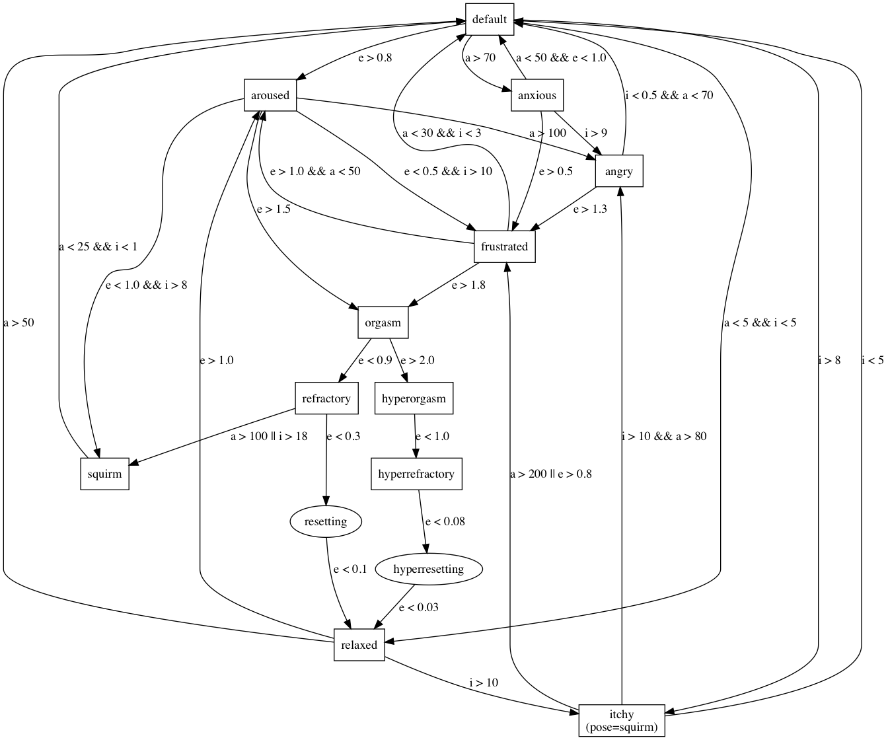

## All visible poses

angry: 
anxious: 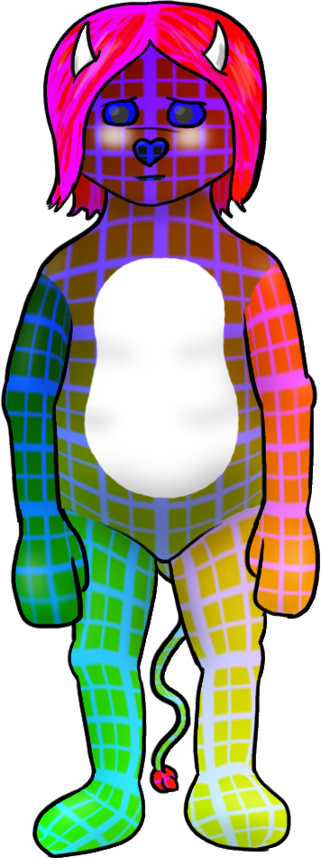
aroused: 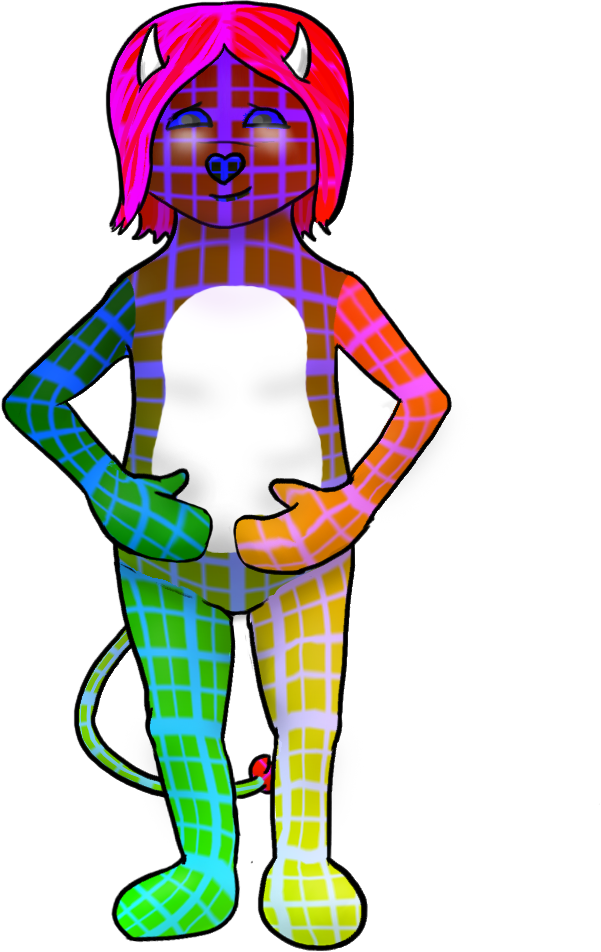
default: 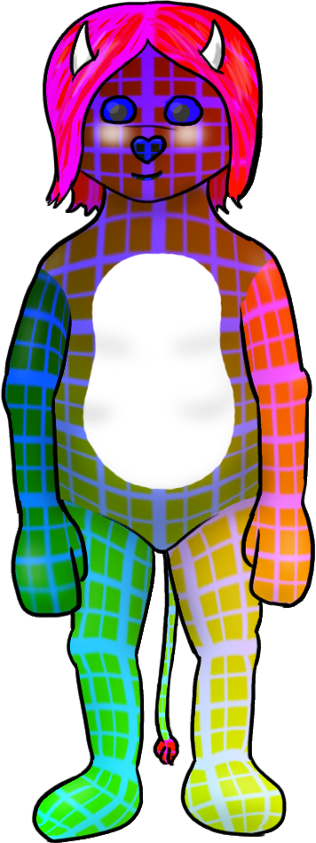
frustrated: 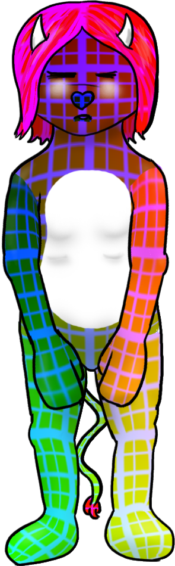
hyperorgasm: 
hyperrefractory: 
orgasm: 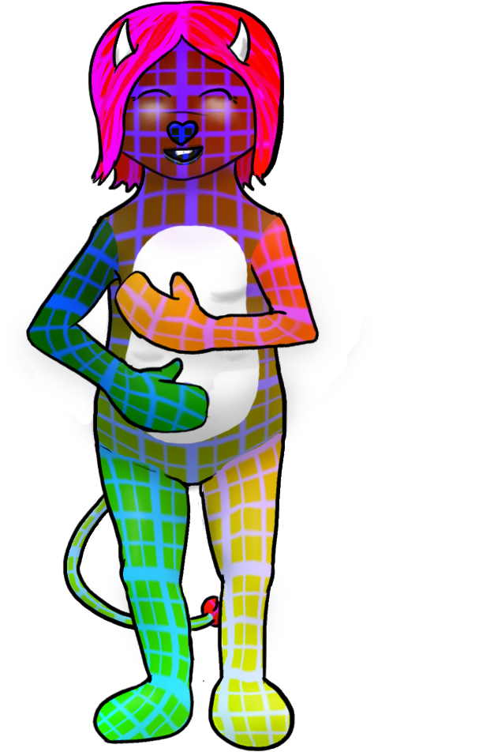
refractory: 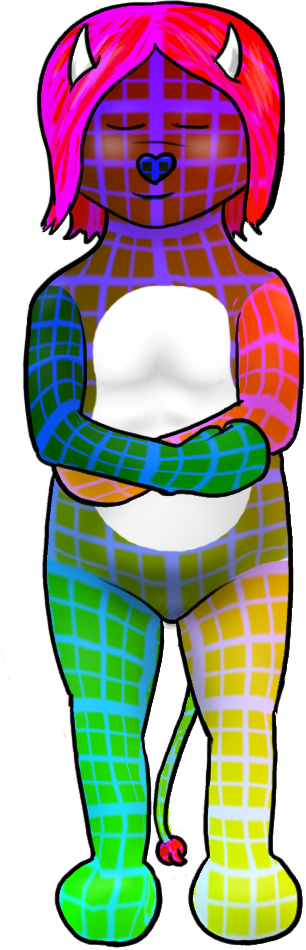
relaxed: 
squirm: 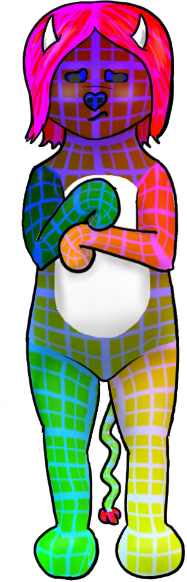

</body></html>
